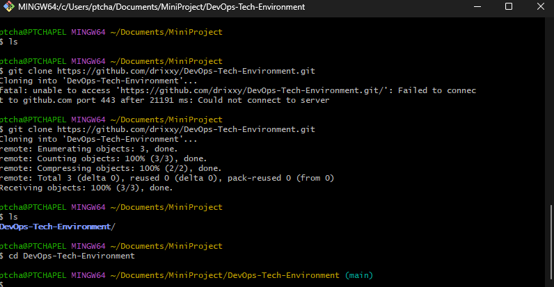
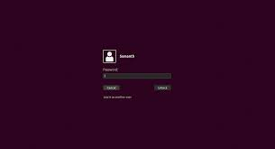

#ALL DevOps Tech Environment Setup

This project showcases my Local DevOps environment, intergrating essentials tools for automation, cloud computing, and development workflows

## Tech Stack
- **AWS** - cloud infrastruture for deployment
- **Git Bash** - command-line interface for automation.
- **VS code** - Code editor for development
- **Ubuntu** - Linux-based environment for containerization

## Screenshots
### AWS
_Cloud environment setup_

### Git Bash
_Terminal for Managing repositories_

### VS Code
_Development and Integration of DevOps tools._

### Ubuntu 
_Linux-based environment for scripting._

